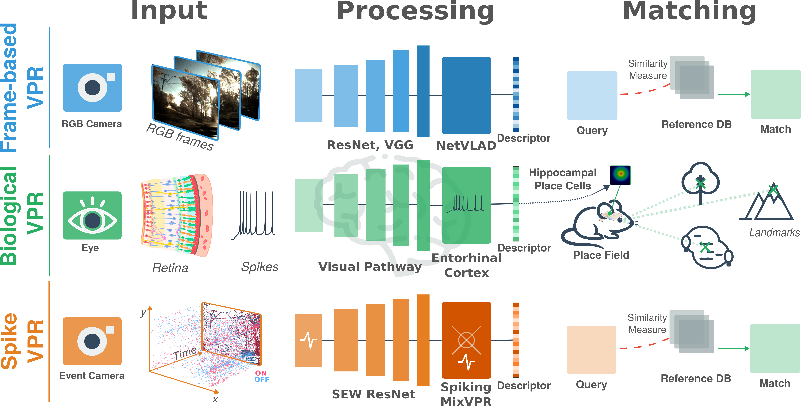
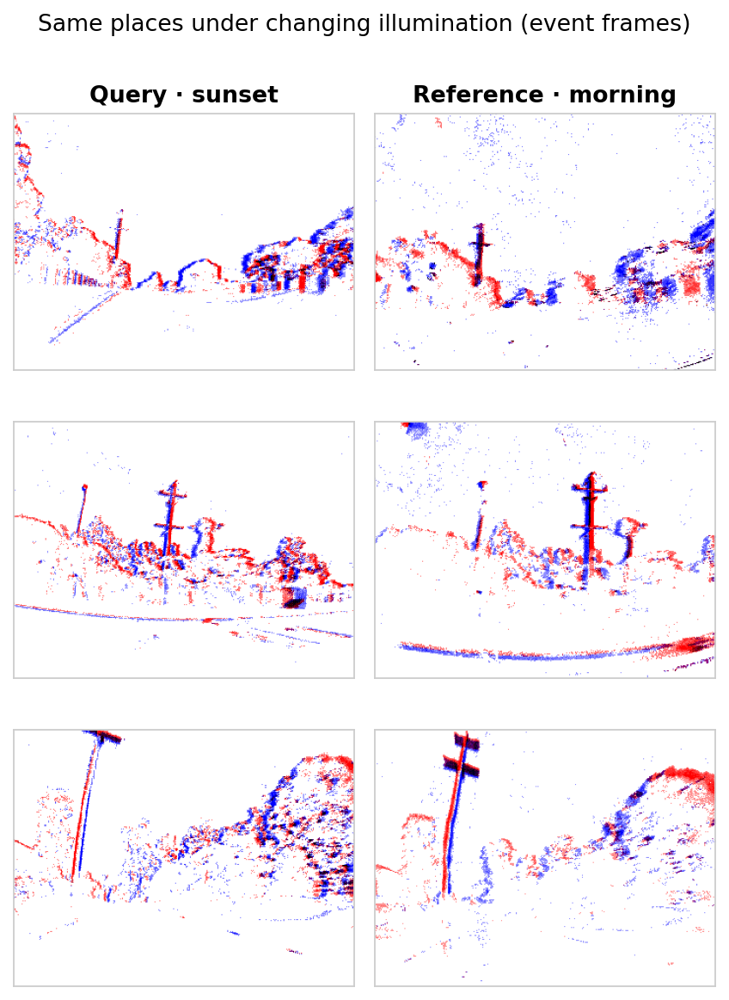
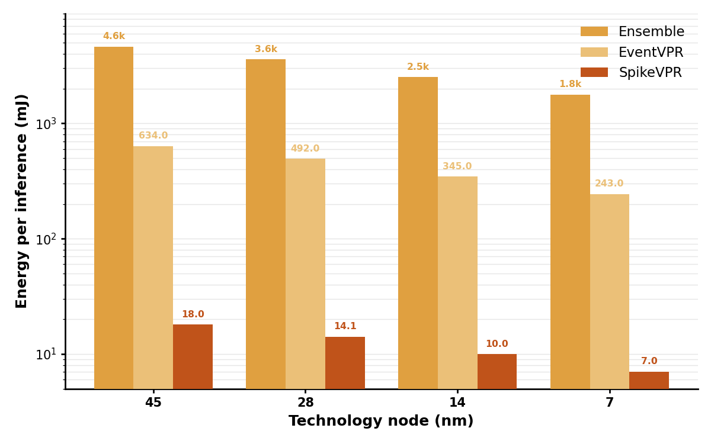
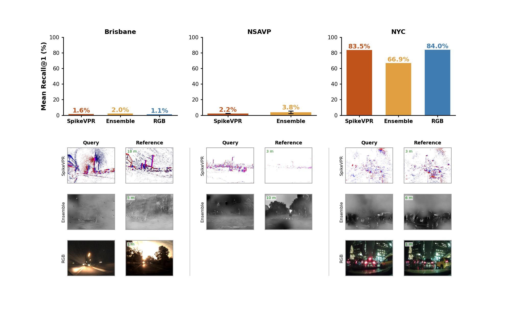

# SpikeVPR

```text
  ______             __  __                 __     __  _______   _______  
 /      \           |  \|  \               |  \   |  \|       \ |       \ 
|  $$$$$$\  ______   \$$| $$   __   ______ | $$   | $$| $$$$$$$\| $$$$$$$\
| $$___\$$ /      \ |  \| $$  /  \ /      \| $$   | $$| $$__/ $$| $$__| $$
 \$$    \ |  $$$$$$\| $$| $$_/  $$|  $$$$$$\\$$\ /  $$| $$    $$| $$    $$
 _\$$$$$$\| $$  | $$| $$| $$   $$ | $$    $$ \$$\  $$ | $$$$$$$ | $$$$$$$\
|  \__| $$| $$__/ $$| $$| $$$$$$\ | $$$$$$$$  \$$ $$  | $$      | $$  | $$
 \$$    $$| $$    $$| $$| $$  \$$\ \$$     \   \$$$   | $$      | $$  | $$
  \$$$$$$ | $$$$$$$  \$$ \$$   \$$  \$$$$$$$    \$     \$$       \$$   \$$
          | $$                                                            
          | $$                                                            
           \$$                                                                                                      
```


**Event-Driven Neuromorphic Vision Enables Energy-Efficient Visual Place Recognition**

SpikeVPR pairs a Spiking-Element-Wise (SEW) ResNet backbone built from
depthwise-separable convolutions with a spiking **MixVPR** aggregation head. It
maps a 2-channel (ON/OFF) event frame to a single 4096-D L2-normalised descriptor
and is trained with **InfoNCE** on three event-camera datasets — **Brisbane**,
**NSAVP** and **NYC**.

## Overview

Visual place recognition (VPR) aims to identify previously visited locations from visual input alone. SpikeVPR addresses this task using a fully neuromorphic pipeline:

- **Event camera input** — asynchronous, sparse binary signals encoding illumination changes, robust to lighting and motion blur.
- **Spiking neural network** — a SEW ResNet encoder with depthwise separable convolutions, followed by a spiking MixVPR aggregator, producing N-dimensional descriptors.
- **Contrastive learning** — trained end-to-end with surrogate gradient learning using the NT-Xent loss.
- **EventDilation** — a novel data augmentation strategy that varies the temporal integration window to improve robustness to speed and temporal variations.

```python
from spikevpr.models import build_spikevpr

model = build_spikevpr("sew_resnet34",
                       checkpoint="weights/sew_resnet34_nsavp.pth",
                       neuron_type="LIFNode", eval_mode=True)
descriptor = model(event_frame)   # (B, 2, 260, 346) -> (B, 4096), L2-normalised
```



*Three place-recognition paradigms. **Top:** frame-based VPR (RGB → ResNet/VGG →
NetVLAD descriptor). **Middle:** biological VPR (retina → visual pathway →
entorhinal/hippocampal place cells). **Bottom — SpikeVPR:** an event camera feeds
a spiking SEW-ResNet and a spiking MixVPR head to produce a descriptor matched
against a reference database.*

---

## Install

```bash
cd src
pip install -e .            # or: pip install -r requirements.txt
```

Key dependencies: `torch`, `torchvision`, `spikingjelly==0.0.0.0.15`, `tonic`,
`pytorch-metric-learning`, `scikit-learn`, `geopy`, `pynmea2`. A CUDA GPU is
recommended for training; evaluation and the tutorial run on CPU.

## Weights

Checkpoints are distributed outside git. Fetch them into `weights/`:

## Datasets

Point `configs/<dataset>.yaml → dataset_paths` at your local copy. The expected
on-disk layout and reconstruction notes are in [DATASETS.md](DATASETS.md). Get
the datasets here:

- **Brisbane-Event-VPR**: https://open.qcr.ai/dataset/brisbane_event_vpr_dataset/
- **NSAVP**: https://umautobots.github.io/nsavp
  (ground-truth tooling: [Event-LAB](https://github.com/EventLAB-Team/Event-LAB))
- **NYC-Event-VPR**: https://ai4ce.github.io/NYC-Event-VPR/

All three are fed to the model as (2, 260, 346) ON/OFF event frames (ON red, OFF
blue) — query/reference place pairs across changing illumination look like:

<p align="center"></p>

## Usage

Evaluate a checkpoint (recall@N):

```bash
python -m spikevpr.evaluation.evaluate --dataset nsavp --config configs/nsavp.yaml \
    --encoder sew_resnet34 --checkpoint weights/sew_resnet34_nsavp.pth
```

Train (InfoNCE; best checkpoint kept by val recall@1):

```bash
python -m spikevpr.training.train --dataset brisbane --config configs/brisbane.yaml \
    --encoder sew_resnet34 --output_folder runs/brisbane_r34
```

Estimate inference energy (recomputed from measured spike rate):

```bash
python -m spikevpr.energy.compare --dataset nsavp --config configs/nsavp.yaml \
    --encoder sew_resnet34 --checkpoint weights/sew_resnet34_nsavp.pth \
    --netvlad weights/netvlad_weights.pth --wpca weights/wpca_weights.pth \
    --out results/energy_comparison.json
```

A guided walkthrough (load a model, build a dataset, run recall@N, estimate
energy) is in [notebooks/tutorial.ipynb](./tutorial.ipynb). For the full
data-generation → training → evaluation path, see [RUNBOOK.md](RUNBOOK.md).

## File tree

```
src/
├── README.md                     # this file
├── CHANGES.md                    # how this package relates to the original code + bug fixes
├── DATASETS.md                   # dataset layouts + reconstruction notes
├── pyproject.toml                # installable package (pip install -e .)
├── requirements.txt
├── configs/
│   ├── brisbane.yaml             # paths, traverses, training/eval settings
│   ├── nsavp.yaml
│   └── nyc.yaml
├── spikevpr/
│   ├── models/
│   │   ├── sew_resnet.py         # separable SEW-ResNet 18/34 backbone
│   │   ├── aggregation.py        # MixVPR (+ GEM, MLP) spiking heads
│   │   └── factory.py            # build_spikevpr / build_aggregator
│   ├── data/
│   │   ├── transforms.py         # event + voxel-grid transforms
│   │   ├── gps.py                # NMEA parsing, geodesic / Euclidean distance
│   │   ├── brisbane.py           # BrisbaneProcessing + BrisbanePairDataset
│   │   ├── nsavp.py              # NSAVPDataset
│   │   ├── nyc.py                # NYC voxel-grid datasets (+ zip shims)
│   │   └── loaders.py            # build_datasets(name, config) + transform recipes
│   ├── training/
│   │   ├── losses.py             # InfoNCE (NT-Xent)
│   │   ├── early_stopping.py
│   │   └── train.py              # unified training CLI
│   ├── evaluation/
│   │   ├── metrics.py            # recall@N, precision/recall, NYC strict recall
│   │   ├── baselines.py          # SAD / PCA matching
│   │   └── evaluate.py           # unified evaluation CLI
│   ├── energy/
│   │   ├── estimate.py           # SNN/ANN energy proxies + measurement
│   │   └── compare.py            # recompute SpikeVPR-vs-NetVLAD comparison CLI
│   └── baselines/
│       └── netvlad.py            # NetVLAD (EST + ResNet34 + WPCA) ANN baseline
├── tools/                        # dataset conversion / preparation
│   ├── slice_brisbane.py         # raw Brisbane traverses -> per-place event .npy
│   ├── downsample_nsavp.py       # NSAVP frames 640x480 -> 346x260 (downsampled/)
│   ├── nsavp_to_ensemble.py      # NSAVP -> ensemble-event-vpr text format
│   └── generate_nyc_voxelgrids.py# raw NYC EVT3 -> voxel-grid database/queries zips
├── weights/
│   ├── download_weights.sh       # fetch checkpoints (set SPIKEVPR_WEIGHTS_URL)
│   ├── MANIFEST.md               # checkpoint table + neuron types
│   └── SHA256SUMS.txt            # checksums (.pth files themselves are git-ignored)
├── notebooks/
│   └── tutorial.ipynb            # load model, evaluate, estimate energy, compare
└── figures/                      # README figures (overview, energy, recall, ...)
```

## Reconstructing the datasets

Dataset layouts and how to obtain each one are in [DATASETS.md](DATASETS.md).
Conversion scripts for all three datasets live in `tools/` (the heavier ones need
`pip install -e ".[dataprep]"`):

```bash
# Brisbane: raw traverses -> per-place event .npy
python -m tools.slice_brisbane --input_dir <raw_zips_dir> --out_dir SlicedBrisbane

# NSAVP: downsample frames 640x480 -> 346x260 (creates downsampled/ folders)
python -m tools.downsample_nsavp nsavp --batch

# NSAVP: export to ensemble-event-vpr text format (E2VID ensemble baseline)
python -m tools.nsavp_to_ensemble --nsavp_base nsavp --out_dir ensemble_nsavp

# NYC: raw EVT3 streams -> voxel-grid database/queries zips
python -m tools.generate_nyc_voxelgrids --raw_dir NYC-Event-VPR_raw_data \
    --out_dir NYC-Event-VPR_VoxelGrid --work_dir raw_work --voxel_bins 15
```

The NSAVP raw recordings → per-frame `.npy` export is an upstream NSAVP step
(see DATASETS.md); the downsampler above handles the resolution conversion.
See [RUNBOOK.md](RUNBOOK.md) for the full ordered pipeline.

## Results

Figures from the paper (regenerate them with `spikevpr.energy.compare` and the
evaluation CLIs; see [RUNBOOK.md](RUNBOOK.md)).

**Energy per inference** across CMOS technology nodes — SpikeVPR is one to two
orders of magnitude more efficient than the NetVLAD ANN ensemble and the
event-VPR ResNet baseline (log scale, mJ):

<p align="center"></p>

**Night-condition summary** — mean Recall@1 across all three datasets, with
qualitative query/reference examples (SpikeVPR event frames, E2VID ensemble
reconstructions, RGB):

<p align="center"></p>

## Model

- **Backbone**: `SEWResNet` (`sew_resnet18` / `sew_resnet34`) with depthwise +
  pointwise convolutions, 2-channel event-frame input, single time step (T=1),
  `connect_f="ADD"`, stateless (membrane potentials reset each forward).
- **Head**: spiking `MixVPR` (`mix_depth=3`, `out_channels=512`, `out_rows=8`
  → 4096-D), L2-normalised output.
- **Training**: InfoNCE / NT-Xent over (anchor, positive) pairs labelled by place;
  AdamW + OneCycleLR; early stopping on validation recall@1.
- **EventDilation**: the paper's augmentation — each training sample is built from
  a random-length temporal window of the event stream, improving robustness to
  speed / temporal variation. Configurable per dataset (`data.dilation_window` for
  Brisbane/NSAVP, `data.dilation_t_min` for NYC voxel grids); set
  `data.event_dilation: false` to disable it on Brisbane.

## References

- Fang et al., *Deep Residual Learning in Spiking Neural Networks* (SEW-ResNet), 2021.
- Ali-bey et al., *MixVPR: Feature Mixing for Visual Place Recognition*, 2023.
- Fischer & Milford, *Event-Based Visual Place Recognition With Ensembles of Temporal Windows*, 2020.
- Arandjelović et al., *NetVLAD*, 2016.
- Dampfhoffer et al. (2023) and Lemaire et al. (2022) — SNN/ANN energy proxies.

## Citation

If you use SpikeVPR, please cite:

> Keime, Cuperlier & Cottereau, *Event-Driven Neuromorphic Vision Enables
> Energy-Efficient Visual Place Recognition*, arXiv:2604.03277, 2026.

```bibtex
@online{keime2026spikevpr,
  title        = {Event-Driven Neuromorphic Vision Enables Energy-Efficient Visual Place Recognition},
  author       = {Keime, Geoffroy and Cuperlier, Nicolas and Cottereau, Benoit R.},
  date         = {2026-03-24},
  eprint       = {2604.03277},
  eprinttype   = {arXiv},
  eprintclass  = {cs.CV},
  doi          = {10.48550/arXiv.2604.03277},
  url          = {https://arxiv.org/abs/2604.03277}
}
```
## Acknowledgments

This work was supported by the French Defense Innovation Agency (AID) under grant 2023 65 0082.


